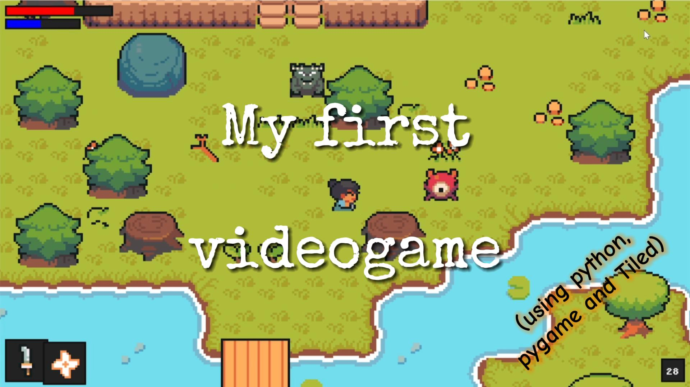

# samurai-quest

A basic RPG game, in which a samurai must fight his way through monsters of any kind. I build this mainly as exercise to practice python and programming in general, but also to dive in how videogames actually work.

## Getting Started

These instructions will get you a copy of the project up and running on your local machine for development and testing purposes. See deployment for notes on how to deploy the project on a live system.

### Prerequisites

- Python 3
- pygame library

I tested this game on my computer, in which Windows 10 is installed.


### Installing

Copy all the content of this repo (included sub-repos) to your local machine, and run the main.py file using one of the many Python IDEs or simply stating in your terminal (in the root folder)

```
python main.py
```

If the game window is full-screen, use the Windows button on your keyboard to exit from the program,then close it by right-clicking on it (on the Windows bottom bar) and hitting Close window. 

## Commands

* The arrow buttons on your keyboard allow your player to move across the map
* The 'q' key allows you to change weapon
* The 'e' key allows you to change spell
* The 'space' key allows you to attack with a weapon
* The 'ctrl' key allows you to cast a spell
* the 'm' key allows you to open and close the upgrade menu

In the upgrade menu you can spend your gained experience points (XPs) to increase one or more of your statistics. Use left and right arrow keys to navigate the menu and 'space' key to increase the value of the selected statistic.

You have 2 weapons, a Katana and a Spear.

You have 2 spells, a flame shuriken and a healing spell. For spells you need to have enough energy, which is shown in the blue energy bar. The energy bar slowly recovers with time.

## Example Video

[](https://youtu.be/xEBBMNF_De0)

## Future implementations

* When health points go to 0, the code now stops the program and exit it. In future I'd like to implement a game over page that gives you the possibility to start over the game
* I'd like to implement some sort of 'boon' item: when the player collect this item, he has won
* I'd like to change the game map, and create a new one which deals with the 'dark outsides' problem of the game

## Built With

* pygame - Python game library
* Tiled - graphic app to build videogame maps using tileset
* [NinjaAdventure Tileset](https://pixel-boy.itch.io/ninja-adventure-asset-pack) - Made by Pixel-Boy and AAA (https://www.patreon.com/pixelarchipel)

## Authors

* **Dabih Isidori** - [dabihdevs](https://github.com/dabihdevs)

## License

see the [LICENSE.md](LICENSE.md) file for details.
